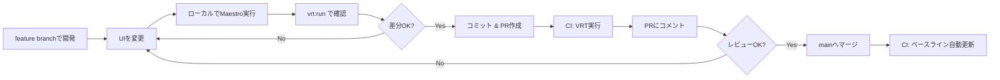

# VRT CI/CD セットアップガイド

## 概要

このプロジェクトではVisual Regression Testing (VRT)をCI/CDパイプラインに組み込んでいます。

### ローカル vs CI の違い

| 環境 | ベースライン | 比較対象 | ベースライン更新 |
|------|------------|---------|----------------|
| **ローカル** | `HEAD~1` | `HEAD` | 手動 (`bun run vrt:update`) |
| **CI (PR)** | `main` ブランチ | PR ブランチ | なし（比較のみ） |
| **CI (main push)** | - | `main` | 自動（mainへのpush時） |

## GitHub Secrets の設定

VRTをCIで動作させるには、以下のシークレットをGitHubリポジトリに設定する必要があります：

### 1. GCP_SA_KEY

Google Cloud StorageのサービスアカウントキーをJSON形式で設定します。

```bash
# 1. apps/cool-app/vrt-sample-4dde33b657e4.json の内容をコピー
cat apps/cool-app/vrt-sample-4dde33b657e4.json

# 2. GitHubリポジトリの Settings > Secrets and variables > Actions に移動
# 3. "New repository secret" をクリック
# 4. Name: GCP_SA_KEY
# 5. Value: JSONの内容全体を貼り付け
```

**重要**: ローカルのキーファイル（`vrt-sample-4dde33b657e4.json`）は絶対にコミットしないでください。

## CI/CDワークフロー

### Pull Request時の動作

1. **E2Eテスト実行**: Maestroでスクリーンショット取得
2. **VRT比較**: mainブランチのベースラインと比較
   ```bash
   EXPECTED_KEY=${{ github.event.pull_request.base.sha }}  # mainの最新コミット
   ACTUAL_KEY=${{ github.sha }}                             # PRの最新コミット
   ```
3. **結果をPRにコメント**: 差分があればPRにコメント

### mainブランチへのpush時の動作

1. **E2Eテスト実行**: Maestroでスクリーンショット取得
2. **ベースライン自動更新**: GCSに新しいベースラインを保存
   ```bash
   ACTUAL_KEY=${{ github.sha }}  # mainの最新コミット
   bun run vrt:ci:update
   ```

## ローカル開発

### 基本的な使い方

```bash
# 1. UI変更を実装
# 2. Maestroテスト実行（スクリーンショット取得）
bun run maestro:ios

# 3. 前のコミットと比較
bun run vrt:run

# 4. 差分が期待通りなら、変更をコミット
git add . && git commit -m "feat: Update UI"

# 5. ベースライン更新（次回の比較で使用）
bun run vrt:update
```

### 任意のコミット同士を比較（ワンライナー）

```bash
# 5個前のコミットと比較
EXPECTED_KEY=$(git rev-parse HEAD~5) \
ACTUAL_KEY=$(git rev-parse HEAD) \
GOOGLE_APPLICATION_CREDENTIALS=./vrt-sample-4dde33b657e4.json \
npx reg-suit run && open .reg/index.html

# タグとの比較
EXPECTED_KEY=$(git rev-parse v1.0.0) \
ACTUAL_KEY=$(git rev-parse HEAD) \
GOOGLE_APPLICATION_CREDENTIALS=./vrt-sample-4dde33b657e4.json \
npx reg-suit run && open .reg/index.html
```

## トラブルシューティング

### CI: "Failed to detect the previous snapshot key"

**原因**: GCS上にベースラインが存在しない

**解決策**: mainブランチでベースラインを作成
```bash
# mainブランチで実行
bun run maestro:ios
bun run vrt:update
```

### CI: GCS認証エラー

**原因**: `GCP_SA_KEY` シークレットが未設定または不正

**解決策**: GitHub Secretsを確認
1. リポジトリの Settings > Secrets and variables > Actions
2. `GCP_SA_KEY` が存在し、正しいJSON形式か確認
3. サービスアカウントに「Storage Object Admin」権限があるか確認

### ローカル: ベースラインが古い

**原因**: 長期間 `vrt:update` を実行していない

**解決策**: ベースラインを再作成
```bash
# 最新のスクリーンショットでベースライン更新
bun run maestro:ios
bun run vrt:update
```

## 運用フロー

### 機能追加時（PRワークフロー）



### 注意点

1. **PRではベースライン更新しない**:
   - PRでは比較のみ実施
   - mainマージ後に自動更新

2. **並列PR時の競合**:
   - 複数のPRが同時にmainにマージされる場合、ベースライン競合の可能性
   - 推奨: 1つずつマージ、またはrebaseしてから再度VRT実行

3. **差分の許容範囲**:
   - `regconfig.json` の `thresholdRate: 0.001` (0.1%)
   - 必要に応じて調整可能

## 参考資料

- [reg-suit公式ドキュメント](https://github.com/reg-viz/reg-suit)
- [reg-simple-keygen-plugin](https://github.com/reg-viz/reg-suit/tree/master/packages/reg-simple-keygen-plugin)
- [GitHub Actions公式ドキュメント](https://docs.github.com/en/actions)
